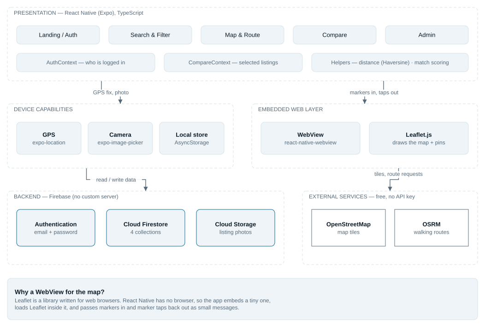
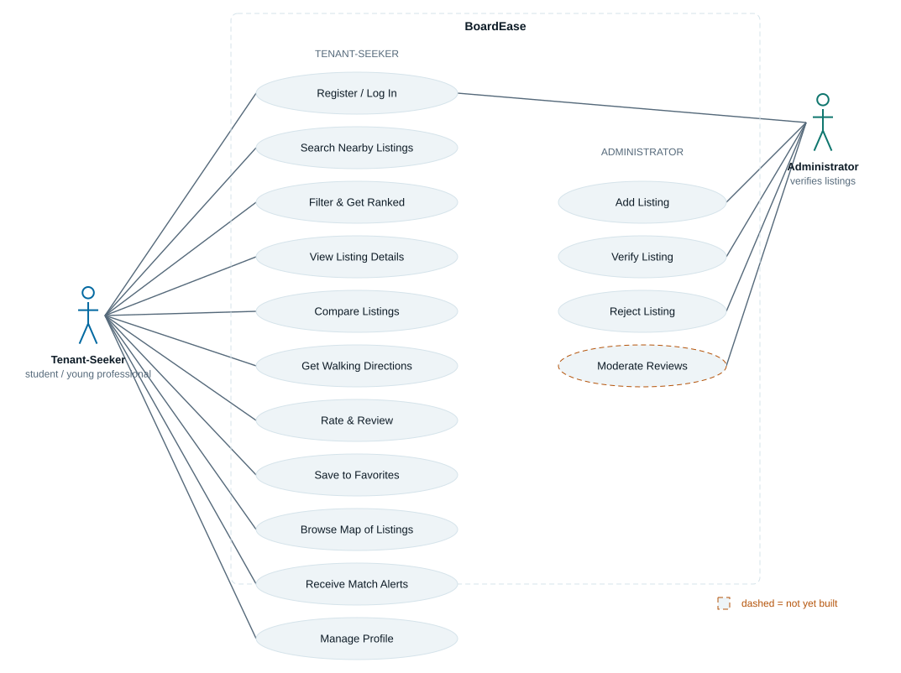
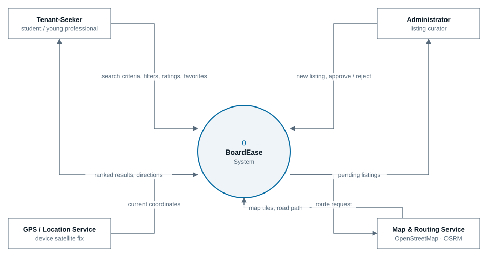
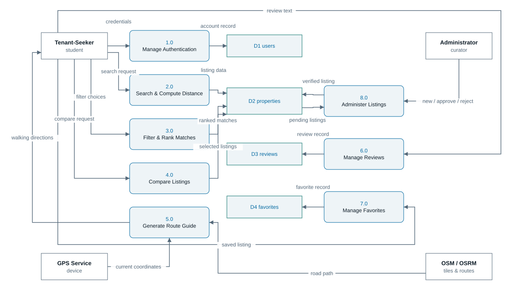
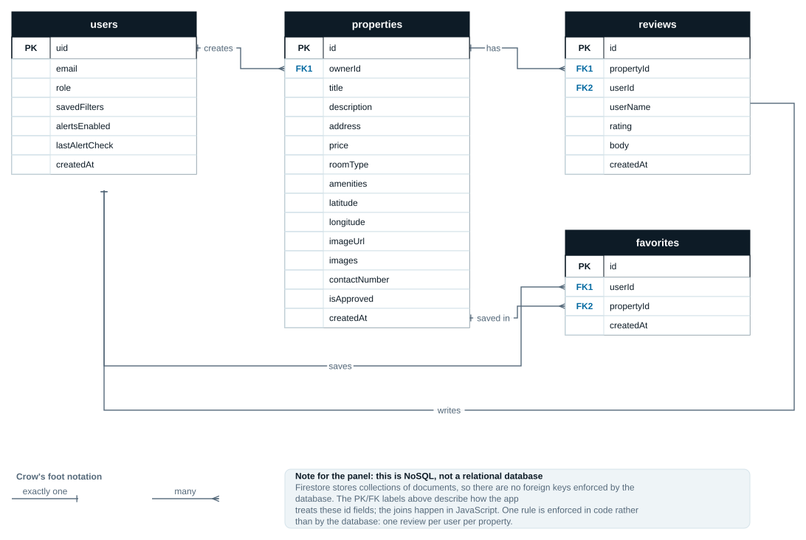
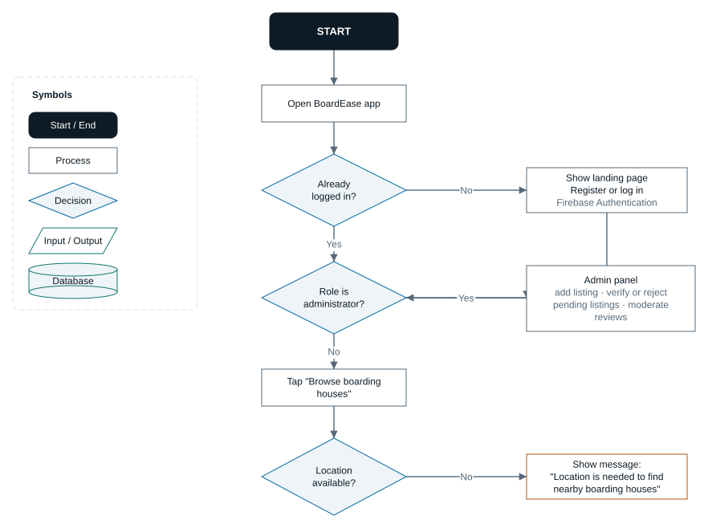
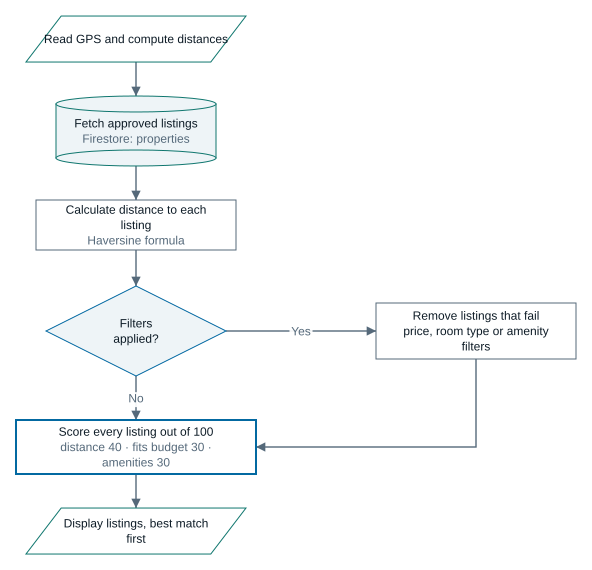
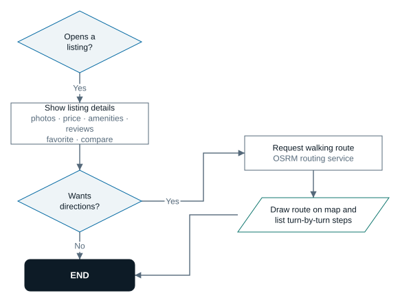

# CHAPTER 2

## Architecture

### System Architecture

BoardEase follows a **client–server architecture with a serverless backend**.
There is no custom application server: the mobile client talks directly to
managed cloud services, and all business logic runs on the device.

The system is drawn in Figure 1 as five bands.

**1. Presentation — React Native (Expo), TypeScript.** The screens themselves:
Landing and Auth, Search and Filter, Map and Route, Compare, and Admin. This
layer holds every piece of application logic in the system — distance
calculation, match scoring, filtering, ranking, and the rules governing what
each role may see.

**2. Device capabilities.** What the handset provides: `expo-location` for GPS,
`expo-image-picker` for the camera and gallery, and `AsyncStorage` for the
offline cache and the saved theme preference.

**3. The embedded web layer.** Maps cannot be drawn natively here, so the
application embeds a `WebView` containing a small HTML page that runs Leaflet.
React Native and this page exchange messages: the application injects marker
and route data into the page, and the page posts marker taps back out. This is
the only part of the client that is not React Native, and it exists because
Leaflet is a browser library with no native equivalent that is free of API keys.

**4. Backend — Firebase, no custom server.** Three managed services in place of
a server the team would otherwise have to write, deploy and maintain:
Authentication for accounts, Cloud Firestore for data, and Storage for listing
photographs. Access control is enforced by server-side security rules rather
than by the client.

**5. External services — free, no API key.** Two of them: OpenStreetMap
supplies map tiles, and OSRM computes walking routes along real roads.

The arrows in Figure 1 carry what moves between the bands: *GPS fix, photo*
from the device, *markers in, taps out* across the WebView boundary, *read /
write data* to Firebase, and *tiles, route requests* to the external services.

**Why serverless.** A custom backend would have meant writing, hosting and
securing an API for a four-person student project with a fixed deadline.
Firebase removes that work, and its security rules give server-enforced access
control that a client-only design could not provide. The cost is dependence on
a third-party platform, recorded in Chapter 1 under external dependencies.

**Implications of client-side logic.** Because scoring, filtering and ranking
run on the device, the application first retrieves the approved listings and
then processes them in memory. This avoids Firestore composite indexes and
keeps the ranking rules readable in one file, but it does mean the whole
approved set is fetched before filtering. At the scale of this study area —
listings in the tens — that is the correct trade. A catalogue in the thousands
would require the filtering to move server-side.

Figure 1 draws those bands. Figure 2, which follows it, describes who uses the
system rather than how it is built. Two actors appear: the tenant-seeker, who
searches, compares, saves and navigates; and the administrator, who curates the
catalogue by approving or rejecting submitted listings and moderating reviews.
One use case is drawn with a dashed outline — *Receive Match Alerts* is
specified and reachable in the data model, but the notification itself is not
yet delivered on the device. That gap is stated again in Chapter 3.





### Technology Stack

| Layer | Technology | Version | Purpose |
|---|---|---|---|
| Framework | React Native | 0.86.3 | Cross-platform UI |
| Runtime | Expo SDK | 57 | Build tooling, native modules, distribution |
| Language | TypeScript | 6.0 | Static typing, strict mode |
| UI runtime | React | 19.2.3 | Component model |
| Navigation | React Navigation | 7 | Native stack and bottom tabs |
| Animation | React Native Reanimated | 4.5.1 | Press feedback, transitions |
| Authentication | Firebase Authentication | 12.19 | Email and password sign-in |
| Database | Cloud Firestore | 12.19 | Listings, reviews, favourites, users |
| File storage | Firebase Storage | 12.19 | Listing photographs |
| Local storage | AsyncStorage | 2.2.0 | Offline cache, theme preference |
| Location | expo-location | 57 | GPS position and live tracking |
| Camera / gallery | expo-image-picker | 57 | Listing photographs |
| Map rendering | Leaflet 1.9.4 in react-native-webview | 13.16 | Map, markers, route line |
| Map tiles | OpenStreetMap | — | Map imagery, no key required |
| Routing | OSRM | — | Walking routes, no key required |
| Typography | Plus Jakarta Sans, Inter | — | Loaded through expo-font |
| Icons | Ionicons via @expo/vector-icons | 15 | Interface icons |

Every dependency is free and, apart from the Firebase project itself, requires
no account or API key. This was a deliberate constraint: a key that expires or
exceeds a free tier would take the application down during the defence.

### Data Flow

Figure 3 shows the whole application as a single process and names the four
parties it exchanges data with: the tenant-seeker, the administrator, the
device's location service, and the map and routing services. Figure 4 opens that
single process into the eight numbered processes and four data stores that carry
out the work. Both are drawn in the conventional data flow notation so they can
be read against the descriptions below.

Data moves through the system in five main flows.

**Authentication.** Credentials entered on the Login or Register screen are
passed to Firebase Authentication. On success Firebase returns a session, and
`AuthContext` reads the matching `users/{uid}` document to learn the account's
role. That role decides which screens are reachable.

**Search and ranking.** The Search screen requests the device's position from
`expo-location`, then queries Firestore for every property where
`isApproved == true`. For each listing the Haversine formula gives the distance
from the user, and `scoreProperties` assigns a match score out of 100. The
scored list is sorted and displayed. The user's filter choices are applied in
memory before scoring.

**Navigation.** Selecting a listing sends the user's coordinates and the
listing's coordinates to OSRM, which returns a road-following path and a list
of turn-by-turn steps. The path is injected into the Leaflet page as a
polyline. While the Route Guide screen is open, `watchPositionAsync` streams new
positions roughly every five metres; the remaining distance is recomputed on
each update, and if the user is more than 45 metres from the drawn path a new
route is requested.

**Reviews and ratings.** A submitted review is written to the `reviews`
collection. Screens showing a rating read every review for that listing and
compute the average on the device rather than storing it, so a deleted review
is reflected immediately with no denormalised value to keep in step.

**Offline caching.** Successful reads of the favourites list are copied to
AsyncStorage, and each opened listing is recorded there. When Firestore cannot
be reached, those copies are shown behind a banner saying so. The cache is
cleared on logout.





---

## Design

### User Interface Design

The interface is built on a **design system**: a single file defines every
colour, size, spacing value and corner radius, and no screen is permitted to
write a raw value. This was not the original approach. The first build chose
values per screen and accumulated fifteen distinct font sizes, five font
weights, and spacing that had drifted off its own scale — which is precisely
why it read as unfinished.

**Spacing.** One scale: 4, 8, 12, 16, 24, 32, 48. Nothing between. Space
between related items is smaller than the space around the group they form; a
label sits 4 from its input while the field group sits 16 from the next one.

**Type.** Nine named roles rather than arbitrary sizes — display, title,
heading, body, bodyStrong, caption, captionStrong, micro, metric. Each carries
its own family, size and line height, so a screen asks for *heading* rather
than for 19 pixels. Line height is always set, because the platform default is
too tight to scan.

**Colour.** Two palettes of identical shape, light and dark, so any component
can read a semantic name such as `surface` or `danger` without knowing which is
active. Every semantic colour has a matching soft tint; status is shown as dark
text on that tint rather than white on full strength, which is heavier than the
information usually deserves.

**Elevation.** Three tiers, so the interface has a front and a back. The first
build had one shadow applied to cards, buttons and pills alike, which is why
nothing ever appeared to sit above anything else.

**Component kit.** Twelve shared components — Text, Button, Card, Input, Pill,
Rating, Skeleton, EmptyState, ErrorState, PropertyCard, PropertyPhoto and
Screen. Behaviour that must be consistent is enforced here rather than
re-implemented per screen: a minimum 44-point touch target, a visible pressed
state, an accessible name on every icon-only control.

**The four states.** Every screen that loads data provides content, loading,
empty and error. The two kinds of empty are worded differently: "nothing exists
yet" invites the user to act, while "nothing matched" echoes the query and
offers an escape.

**Theming.** Light and dark are selectable, or follow the device. The choice is
stored on the device and survives a restart.

### Database Design

Cloud Firestore is a document database, so the design is four collections of
documents rather than relational tables. Relationships are expressed by storing
the identifier of the related document. Figure 5 sets out the four collections,
their fields and the relationships between them in crow's foot notation; the
tables below give the type and purpose of each field.

**`users/{uid}`** — one document per account, keyed by the Firebase
Authentication user id.

| Field | Type | Notes |
|---|---|---|
| `uid` | string | Document key; matches the Auth user |
| `email` | string | Sign-in address |
| `role` | string | `tenant` or `admin`; decides what is reachable |
| `savedFilters` | map | Filters saved for match alerts |
| `alertsEnabled` | boolean | Whether alerts are active |
| `lastAlertCheck` | number | Timestamp; stops one listing alerting twice |
| `createdAt` | number | Milliseconds since epoch |

**`properties/{id}`** — one document per boarding house.

| Field | Type | Notes |
|---|---|---|
| `id` | string | Firestore document id |
| `title`, `description`, `address` | string | Listing text |
| `price` | number | Monthly rent in pesos |
| `roomType` | string | Single, Shared, or Studio |
| `amenities` | array of string | e.g. `["WiFi", "Own CR"]` |
| `latitude`, `longitude` | number | Used for distance and routing |
| `imageUrl` | string | Storage download URL, or empty |
| `ownerId` | string | Account that submitted it |
| `isApproved` | boolean | Only `true` appears in search |
| `createdAt` | number | Also drives match alerts |

**`reviews/{id}`** — one document per review. `propertyId` and `userId` link it
to a listing and an account. One review per user per listing is enforced by the
application before writing.

**`favorites/{id}`** — one document per saved listing, holding only `userId`,
`propertyId` and `createdAt`. The listing itself is **not** copied, so a price
change is never stale in a user's shortlist.

**Design decisions worth stating:**

- **Money is stored as a number, not a string**, so comparisons and budget
  scoring are arithmetic rather than text handling.
- **Timestamps are numbers** (milliseconds), which sort correctly and need no
  parsing.
- **Ratings are not denormalised.** No average is stored on the listing; it is
  computed from the reviews each time. A stored average would have to be
  recalculated on every write and would drift if any update were missed.
- **Filtering is not done with compound Firestore queries.** Those require
  manually created composite indexes. With a small catalogue, filtering in
  memory is simpler and has no infrastructure cost.



### API Design

BoardEase exposes no API of its own. It consumes three.

**Firebase Authentication** — through the Firebase JavaScript SDK, not raw
HTTP. `signInWithEmailAndPassword`, `createUserWithEmailAndPassword`,
`sendPasswordResetEmail`, `signOut`, and an `onAuthStateChanged` listener that
keeps the session current. Failures return codes such as
`auth/invalid-credential`, which the application translates into wording a user
can act on.

**Cloud Firestore** — also through the SDK: `getDocs`, `getDoc`, `addDoc`,
`updateDoc`, `deleteDoc`, with `query` and `where` for filtering.
Authentication is the Firebase session; authorisation is the security rules.

The rules enforce, on the server:

| Collection | Read | Write |
|---|---|---|
| `users` | Own document, or any if admin | Own document only; never deleted |
| `properties` | Any signed-in user | Administrators only |
| `reviews` | Any signed-in user | Author may create and edit own; author or admin may delete |
| `favorites` | Own rows only | Own rows only |

**OSRM routing** — the one plain HTTP API.

```
GET https://router.project-osrm.org/route/v1/foot/
      {fromLng},{fromLat};{toLng},{toLat}
      ?overview=full&geometries=geojson&steps=true
```

No authentication. Note the coordinate order: OSRM expects **longitude first**,
the reverse of how coordinates are usually written — a detail that cost time
before it was found. The response supplies a GeoJSON line, a total distance and
duration, and the turn-by-turn steps. A non-OK response returns `null` and the
screen reports that directions are unavailable rather than failing silently.

**OpenStreetMap tiles** — requested by Leaflet inside the WebView:

```
https://tile.openstreetmap.org/{z}/{x}/{y}.png
```

CARTO's tiles were trialled for their dark variant and abandoned: they now
require an API key, and the way they refuse is deceptive — the request returns
HTTP 200 with a valid PNG that has "API KEY REQUIRED" printed across it. A
status-code check passes and the fault appears only on a real device. Dark mode
is instead produced by inverting the tile layer in CSS, which needs no key.

### Process Flow

The architecture, the data flows and the data model each describe one facet of
the system. Figure 6 puts them together as a single path: what happens from the
moment the application is opened to the moment the tenant-seeker is walking to a
boarding house with directions on screen.

It is drawn across three pages so the labels stay readable at the size a page
allows. The first covers opening the application, signing in, and reaching the
point where location is available. The second covers fetching the listings,
filtering and scoring them, and displaying the result. The third covers opening
a listing and walking to it.

Two branches are worth noting. If the device refuses location access the flow
does not stop; it explains why the distance is needed and continues without it.
And if no listing is opened, the flow returns to the filters rather than to the
start, so a search can be narrowed without being retyped.







---

## Development Process

### Development Methodology

The project followed an **iterative, incremental approach**. It was not formal
Scrum — there were no fixed-length sprints, no ceremonies and no story points —
and describing it as such would not survive comparison with the commit history.

What was actually done: a working slice was built, run on a real device,
reviewed, and revised before the next slice began. Each iteration produced
something demonstrable. The clearest example is the interface, which was built,
judged inadequate on a real screen, and rebuilt on a design system — a decision
taken because the first version had been seen running, not because it had been
planned that way.

A second example is structural. The mobile application was first developed
inside the existing Laravel web repository and a port of the web code was
attempted. The port proved unworkable, so the mobile application was rebuilt
cleanly as a standalone project on 22 September. Recording this is more useful
than concealing it: it explains why the mobile repository's history is short
while development began weeks earlier.

### Timeline

Development of the mobile application ran from mid-August to late September
2026. Dates are taken from file timestamps and commit history, not from memory.

| Period | Phase | Evidence |
|---|---|---|
| 19 Aug | First React Native attempt | `Desktop\BoardEase-Mobile` — App.js, app.json |
| 10 Sep | Project scaffolded; Firebase connected; GPS distance and map begun | `mobile/` in the Laravel repo — `tsconfig.json`, `firebaseConfig.ts`, `distance.ts`, `MapScreen.tsx` |
| 15–16 Sep | Routing and match scoring | `routing.ts`, `scoring.ts` |
| 17 Sep | Laboratory requirement | `StudentRegistrationApp` |
| 18 Sep | Prototype attempts | three `figma-plugin` folders |
| 22 Sep | Extracted to a standalone repository | first commit, `BoardEase_Mobile` |
| 22–23 Sep | Design system; all 16 screens rebuilt; clickable Figma prototype | 12 commits |
| 24–25 Sep | Diagrams updated; Chapters 1–3 written | this document |

**Gantt chart**

```
                          Aug 19    Sep 10   Sep 15   Sep 18   Sep 22   Sep 25
Setup and Firebase        ██████████████
Core logic (GPS, routing,             ████████████
  scoring)
Screens and features                       ████████████
Prototyping                                      ████████
Repository restructure                                 ██████
UI redesign                                              ████████
Documentation and diagrams                                     ██████
```

### Version Control

**Git**, with the remote at `github.com/jetroo1/BoardEase-Mobile`.

**Branching strategy: none — a single `main` branch.** Every change was
committed directly. For four people working largely in sequence rather than in
parallel, feature branches would have added ceremony without preventing any
conflict that actually occurred. This is stated plainly rather than claimed as
a workflow that was not used.

Conventions that were followed:

- Commit messages state what changed **and why**, not only what
- Generated and local files are excluded through `.gitignore` — `node_modules`,
  Expo caches, editor configuration, and the generated preview images
- The repository contains the application, its scripts and its documentation;
  the Laravel web application lives in a separate repository

The mobile repository holds 13 commits. Its history begins on 22 September
because that is when the project was extracted, not when development started.

### Code Review Process

**During development, review was informal.** There were no pull requests and no
required approval before merging. Members worked on different areas and checked
each other's work by running the application rather than by reading diffs.

**A structured review was performed before documentation.** The complete change
set was examined against a defined set of criteria — correctness, error
handling, duplicated logic, and interface state coverage. It produced **ten
defects**, all of which were fixed and are listed in Chapter 3 under Bug
Tracking. Several could not have been found by running the application: a GPS
subscription that was never released on unmount, for example, leaks battery
silently.

The standards applied, which also guided development:

| Area | Standard |
|---|---|
| Error handling | Every network call handles its own failure and offers a retry |
| Feedback | A failed write is reverted in the interface **and reported** |
| Duplication | Shared behaviour lives in one place; the favourites bug in Chapter 3 was caused by breaking this |
| Interface states | Every data screen provides content, loading, empty and error |
| Destructive actions | Confirm, and name what will be destroyed |
| Typing | `tsc --noEmit` passes with no errors before any commit |

---

*Chapter 3 covers testing, deployment and maintenance.*
